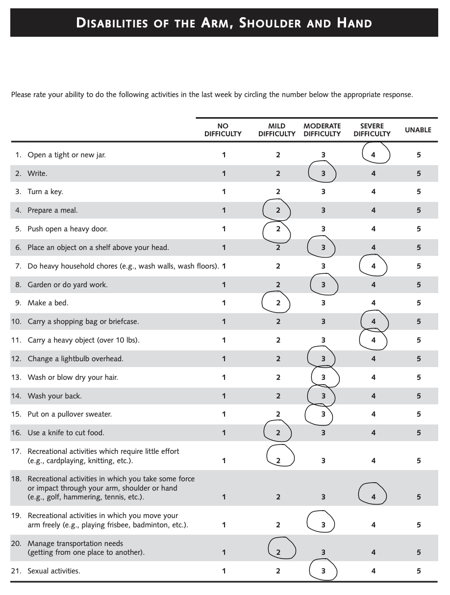

# student-injury [](https://github.com/prettier/prettier) [](https://github.com/psf/black)

## Overview
The purpose of this project is to simplify the process that student athletes take when filling out "Patient Outcome Reported Measures" forms 



## Locally Host in Deployment environment

Clone the repository

```sh
git clone git@github.com:shama2025/student-injury.git
```

Install requirements.txt

```sh
python -m pip install requirements.txt
```

Run the angular application

```sh
ng serve
```

Run the flask backend

```sh
python -m flask run

Click locally hosted application link

http://localhost:4200/
```
